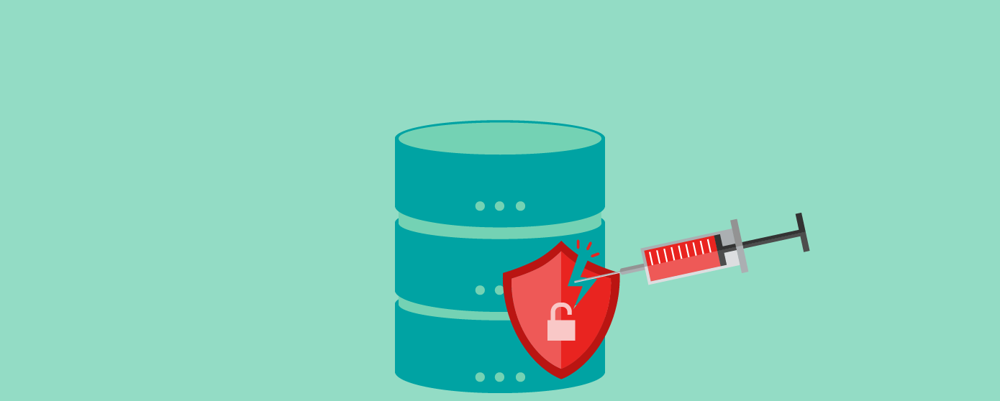

<!-- Dark Mode Toggle -->

  <button id="toggleTheme" onclick="toggleTheme()">🌙</button>

# Portfolio

---

## Navigation

- [Senior Project](#senior-project)
- [Programming Projects](#programming-projects)
- [Lab Projects](#lab-projects)
- [Ethics Papers](#ethics-papers)
- [Presentations](#presentations)
- [Contact for Private Repositories](#contact-for-private-repositories)

---

## <a href="https://github.com/Mick7028/CSU-Senior-Project/blob/master/docs/Defense_Documentation.md" target="_blank">Senior Project</a>

## Programming Projects

---

### [Calculating Average Score and Winner | CSCI 301](project1)

### [Mean, Median, and Mode Calculator | CSCI 325](project2)

### [Ruby on Rails Tutorial: Ch. 1 - 5 | CSCI 334](project3)

## Lab Projects

---

### [SQL Injection Attack | CSCI 452](project4)

### [Meltdown Attack Lab | CSCI 452](project5)

## Ethics Papers
-------------

### [Think Ethically](/pdf/Ethics Paper 1.pdf)

-   **Class: CSCI 332**  
-   **Grade: A**

### [Ethics & Computing](/pdf/Ethics Paper 2.pdf)

-   **Class: CSCI 301** 
-   **Grade: A**

### [Can Hacking Be Ethical?](/pdf/Ethics Paper 3.pdf)

-   **Class: CSCI 235** 
-   **Grade: A**

---

## Presentations

### [Ransomware Attacks](/pdf/Security Presentation.pdf)

- **Class: CSCI 301**  
- **Grade: A**

### [SQL Injections](/pdf/SQL Injection.pdf)

- **Class: CSCI 352**  
- **Grade: A**

---

## Contact for Private Repositories

*For access to my private project repositories, please [email me](mailto:michaelson1999@gmail.com?subject=GitHub%20Access) with the subject line, GitHub Access.*

