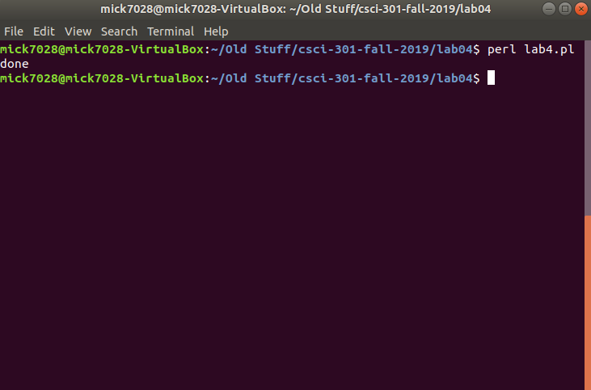
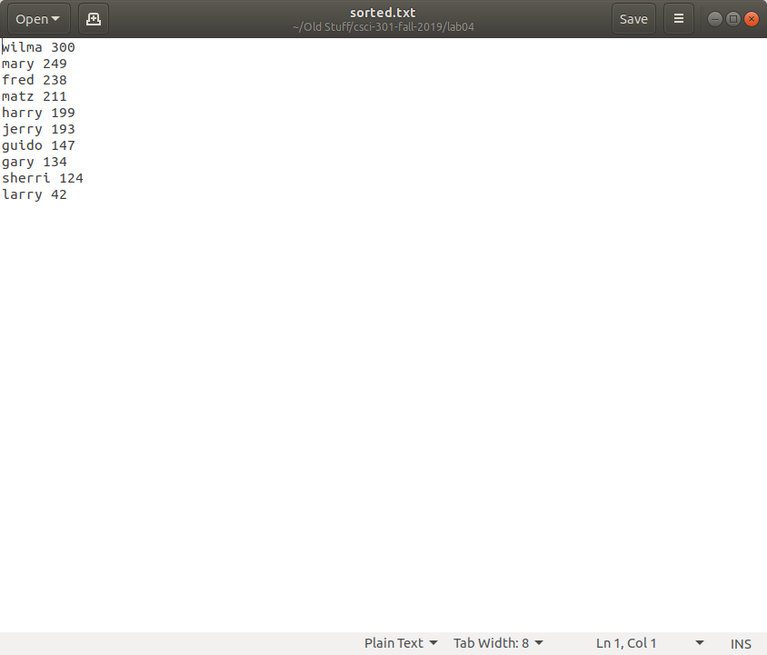
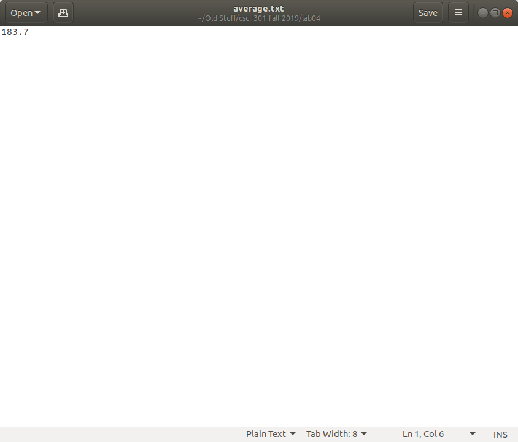
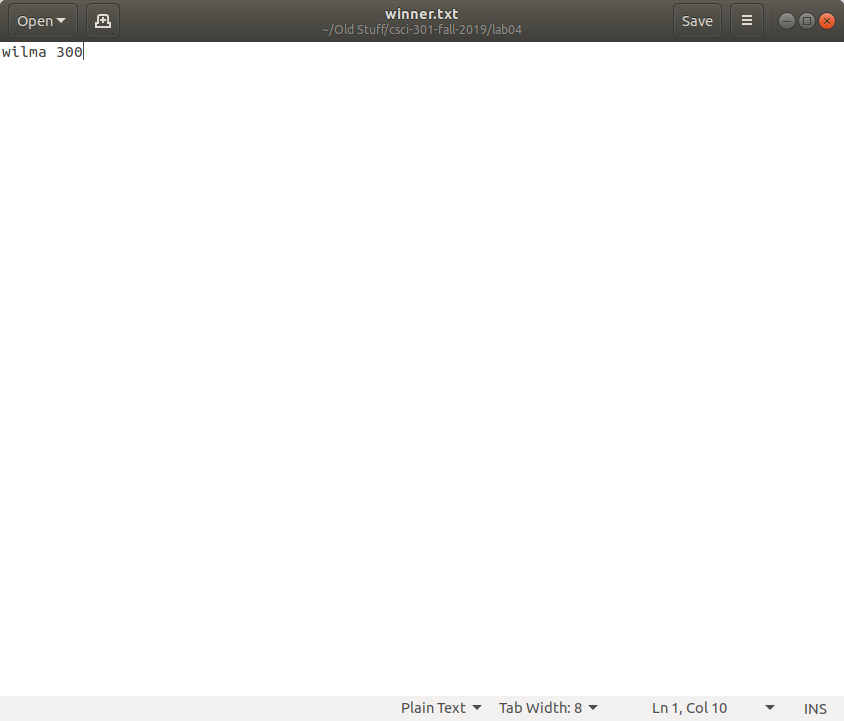

<!-- Dark Mode Toggle -->
<div class="theme-toggle">
  <button id="toggleTheme" onclick="toggleTheme()">🌙</button>
</div>

[Back to Portfolio](./)

Calculating Average Score and Winner
===============

-   **Class: CSCI 301** 
-   **Grade: A**
-   **Language(s): Perl**
-   **Source Code Repository:** [ Mick7028 / Project1 / lab4final.pl](https://github.com/Mick7028/Project1)  
    (Please [email me](mailto:example@csustudent.net?subject=GitHub%20Access) to request access.)

## Project description

This program sorts (highest to lowest) a text file containing lines of names with their score, calculates the average score of the participants, and then determines the highest score. The program reads the original text file of scores, and then creates three new text files for a sorted list of scores, the average of the scores, and the highest score. 

## How to compile / run the program

How to compile (if applicable) and run the project.

```bash
cd ./lab04
perl lab4.pl
```

## UI Design

The user interface of this program is command line, but since it does create text files the results will be shown below.


**Fig 1. Compiling the program.**


**Fig 2. The original list of scores.**


**Fig 3. The scores sorted.**


**Fig 4. The average of the scores.**


**Fig 5. The highest score / winner.**

[Back to Portfolio](./)

<script>
  // Function to toggle theme and update button icon
  function toggleTheme() {
    const body = document.body;
    const button = document.getElementById("toggleTheme");

    if (body.classList.contains("dark-mode")) {
      body.classList.remove("dark-mode");
      localStorage.setItem("theme", "light");
      button.textContent = "☀️"; // Show sun for day mode
    } else {
      body.classList.add("dark-mode");
      localStorage.setItem("theme", "dark");
      button.textContent = "🌙"; // Show moon for night mode
    }
  }

  // Set default theme on page load and update button icon
  document.addEventListener("DOMContentLoaded", () => {
    const body = document.body;
    const button = document.getElementById("toggleTheme");
    const savedTheme = localStorage.getItem("theme");

    if (savedTheme === "dark") {
      body.classList.add("dark-mode");
      button.textContent = "🌙"; // Show moon for night mode
    } else {
      body.classList.remove("dark-mode");
      button.textContent = "☀️"; // Show sun for day mode
    }
  });
</script>

<style>
  :root {
    --background-color: #ffffff;
    --text-color: #000000;
    --link-color: #1a73e8;
    --heading-color: #000000; /* Default heading color */
  }

  body.dark-mode {
    --background-color: #121212;
    --text-color: #e0e0e0;
    --link-color: #bb86fc;
    --heading-color: #ffffff; /* Light heading color for dark mode */
  }

  /* Apply background and text colors globally */
  body {
    background-color: var(--background-color);
    color: var(--text-color);
  }

  /* Ensure headings inherit colors */
  h1, h2, h3, h4, h5, h6 {
    color: var(--heading-color);
  }

  /* Ensure links adapt */
  a {
    color: var(--link-color);
  }

  /* Ensure list items and nested elements inherit text color */
  ul, ol, li, p, span, div, strong, em, b, i {
    color: var(--text-color) !important;
  }

  /* Add a small margin for better list readability */
  ul > li, ol > li {
    margin-bottom: 0.5rem;
  }

  /* Toggle button styling */
  .theme-toggle {
    position: fixed;
    top: 10px;
    right: 10px;
    z-index: 1000;
  }

  #toggleTheme {
    background: none;
    border: none;
    font-size: 1.5rem;
    cursor: pointer;
  }
</style>

