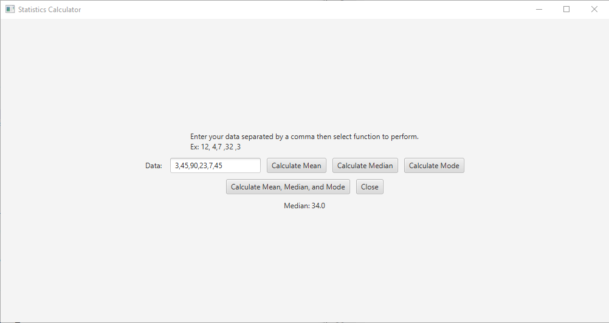

<!-- Dark Mode Toggle -->
<div class="theme-toggle">
  <button id="toggleTheme" onclick="toggleTheme()">🌙</button>
</div>

[Back to Portfolio](./)

Mean, Median, Mode Calculator
===============

-   **Class: CSCI 325** 
-   **Grade: A**
-   **Language(s): Java**
-   **Source Code Repository:** [ Mick7028 / Project2 / lab05final.java](https://github.com/Mick7028/Project2)  
    (Please [email me](mailto:example@csustudent.net?subject=GitHub%20Access) to request access.)

## Project description

This program calculates the mean, median, and mode of a list of integers. To use the program, the user enters integers into a text box and separates each integer with a comma. There are four options for the user. They can choose to see each answer seperately, or choose to see them all together.

## How to compile / run the program

How to compile (if applicable) and run the project.

```Netbeans IDE
While inside the project press "F9" to compile and "shift + F6" to run the program. 
```

## UI Design

The user interface of this program is a graphical user interface which was made using javafx. The menu has a text box for inserting data, and then buttons that call functions to edit the data in the text box. There is also a button for exiting the program.


**Fig 1. The default view when the program is ran.**


**Fig 2. Calculating mean.**


**Fig 3. Calculating median.**


**Fig 4. Calculating mode.**


**Fig 5. Calculating mean, median, and mode.**

[Back to Portfolio](./)

<script>
  // Function to toggle theme and update button icon
  function toggleTheme() {
    const body = document.body;
    const button = document.getElementById("toggleTheme");

    if (body.classList.contains("dark-mode")) {
      body.classList.remove("dark-mode");
      localStorage.setItem("theme", "light");
      button.textContent = "☀️"; // Show sun for day mode
    } else {
      body.classList.add("dark-mode");
      localStorage.setItem("theme", "dark");
      button.textContent = "🌙"; // Show moon for night mode
    }
  }

  // Set default theme on page load and update button icon
  document.addEventListener("DOMContentLoaded", () => {
    const body = document.body;
    const button = document.getElementById("toggleTheme");
    const savedTheme = localStorage.getItem("theme");

    if (savedTheme === "dark") {
      body.classList.add("dark-mode");
      button.textContent = "🌙"; // Show moon for night mode
    } else {
      body.classList.remove("dark-mode");
      button.textContent = "☀️"; // Show sun for day mode
    }
  });
</script>

<style>
  :root {
    --background-color: #ffffff;
    --text-color: #000000;
    --link-color: #1a73e8;
    --heading-color: #000000; /* Default heading color */
  }

  body.dark-mode {
    --background-color: #121212;
    --text-color: #e0e0e0;
    --link-color: #bb86fc;
    --heading-color: #ffffff; /* Light heading color for dark mode */
  }

  body {
    background-color: var(--background-color);
    color: var(--text-color);
  }

  h1, h2, h3, h4, h5, h6 {
    color: var(--heading-color);
  }

  a {
    color: var(--link-color);
  }

  .theme-toggle {
    position: fixed;
    top: 10px;
    right: 10px;
    z-index: 1000;
  }

  #toggleTheme {
    background: none;
    border: none;
    font-size: 1.5rem;
    cursor: pointer;
  }
</style>
