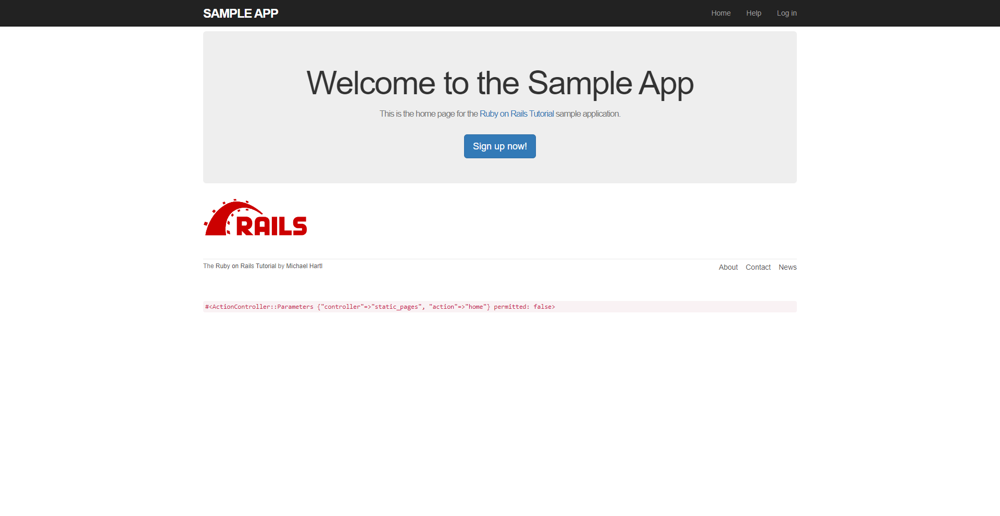
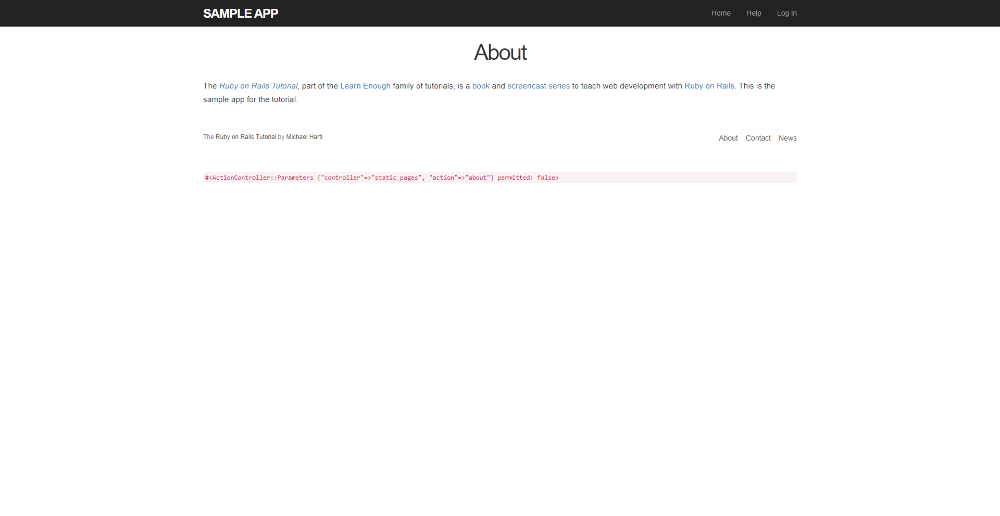
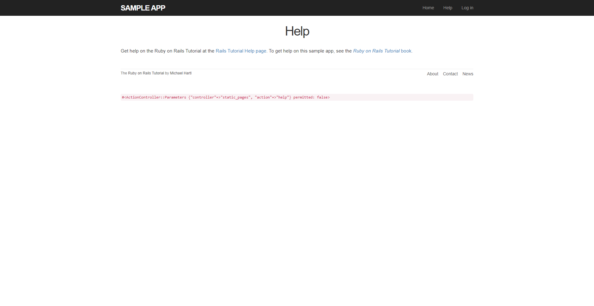
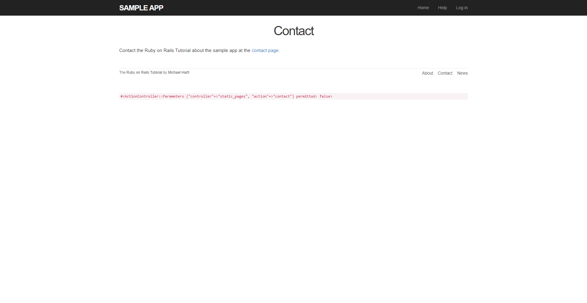

[Back to Portfolio](./)

Ruby on Rails Tutorial: Sample App
===============

-   **Class: CSCI 452** 
-   **Grade: A**
-   **Language(s): Ruby, HTML, CSS, JavaScript**
-   **Source Code Repository:** [ Mick7028 / Sample_App / tree / main / app / controllers](https://github.com/Mick7028/sample_app/tree/main/app/controllers)  
    (Please [email me](mailto:example@csustudent.net?subject=GitHub%20Access) to request access.)
-   **Website Server:** [Sample_App](https://throbbing-pond-4766.fly.dev/)

## Project description
 

## How to compile / run the program

How to compile (if applicable) and run the project: N/A

## UI Design

The user interface of this program is a website.

**Fig 1. Home Page**

**Fig 2. Signup Page**

**Fig 3. About Page**

**Fig 4. Help Page**

**Fig 5. Contact Page**

[Back to Portfolio](./)
