<!-- Dark Mode Toggle -->

  <button id="toggleTheme" onclick="toggleTheme()">🌙</button>

[Back to Portfolio](./)

SQL Injection Project
===============

-   **Class: CSCI 452** 
-   **Grade: N/A**
-   **Language(s): SQL**
-   **Project Instructions:** [Project Instructions](https://github.com/Mick7028/SQL_Injection_Project)
-   **Source Code Repository:** [Mick7028 / SQL_Injection_Project](https://github.com/Mick7028/SQL_Injection_Project)  
    (Please [email me](mailto:example@csustudent.net?subject=GitHub%20Access) to request access.)

## Project description

In this project, we investigate vulnerabilities in SQL statements, particularly targeting SELECT and UPDATE operations. Some of the tasks involved include understanding database structure and executing SQL injection attacks through web and command-line interfaces. The project then goes over manipulating data and showcasing the risks of insecure coding practices. To address these vulnerabilities, a countermeasure was implemented using prepared statements, which successfully defended against the SQL injection attempts emphasizing the importance of secure coding practices in database management systems.

## How to compile / run the program

How to compile (if applicable) and run the project: N/A

## UI Design

The user interface of this project is in command line and on a website.

## Task 1: Get Familiar with SQL Statements

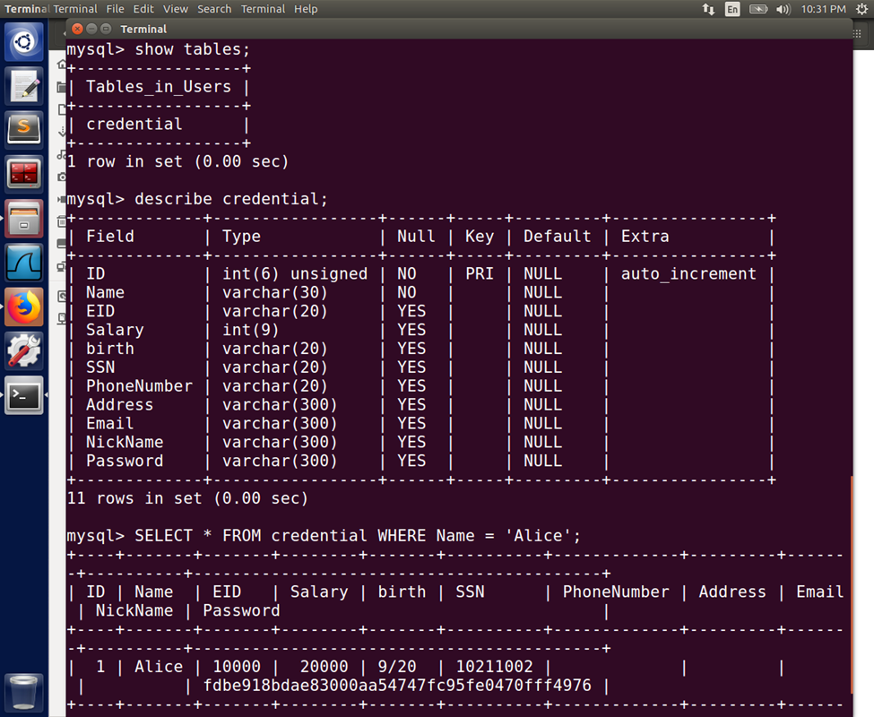
**Fig 1. Task 1: Get Familiar with SQL Statements**

The SQL command needed to print all of the profile information of the employee Alice is: **SELECT * FROM credential WHERE Name = 'Alice';**

Using the command “describe credential;” shows the layout of the employee information table and tells the types of data is contained. This is useful to know for performing SQL injections.

## Task 2: SQL Injection Attack on SELECT Statement

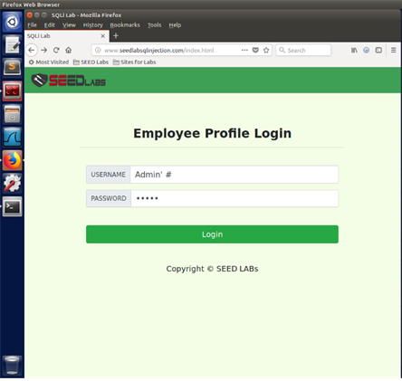
**Fig 2. Task 2.1: SQL Injection Attack from webpage.**

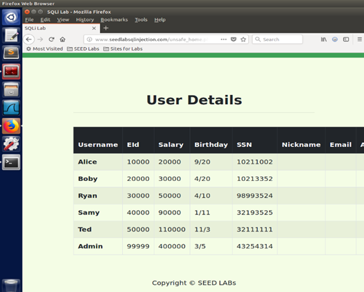
**Fig 3. Task 2.1: SQL Injection Attack from webpage.**

To access the user details, “**Admin’ #**” is put into the username field and “admin” in the password field. Then once you press login, it bypasses the login because the # sign in username comments out the password field.

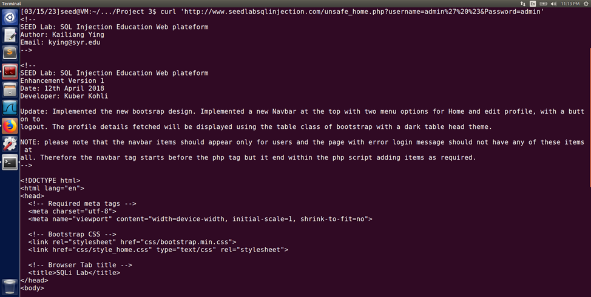
**Fig 4. Task 2.2: SQL Injection Attack from command line.**

**Fig 5. Task 2.2: SQL Injection Attack from command line.**

The curl command needed to perform the SQL injection is:

**curl 'http://www.seedlabsqlinjection.com/unsafe_home.php?username=admin%27%20%23&Password=admin'**

This SQL injection accomplishes the same goal as Task 2.1 and can be automated, but using CLI for SQL injections is less likely to happen than using application interfaces or web forms. This is because to be able to use the CLI method you need to have access to the database server.

**Fig 6. Task 2.3: Append a new SQL statement.**

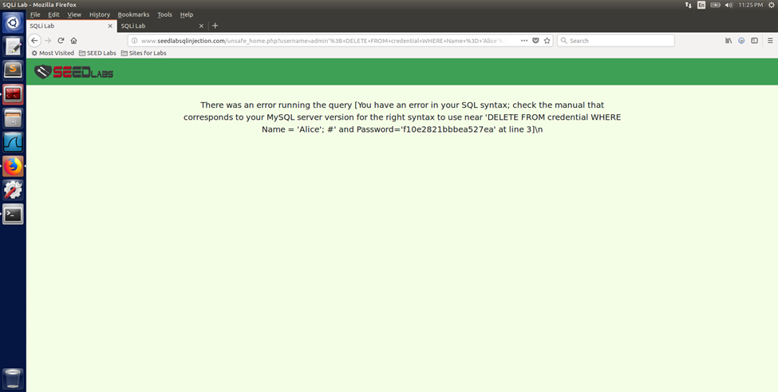
**Fig 7. Task 2.3: Append a new SQL statement.**

To delete, enter this into the username field:

**admin'; DELETE FROM credential WHERE Name = Alice'; #**

In this attempt to use 2 SQL statements, it does not work because most data servers, including this one, do not allow for multiple queries to be performed.

## Task 3: SQL Injection Attack on UPDATE Statement

**Fig 8. Task 3.1: Modify your own salary**

To modify Alice’s salary we need to go to her profile edit page. Once there, we can fill out the text fields (besides Phone Number) with any data we want. Then we can use Phone Number field to carry out an SQL injection which would be: **123’, salary = 80000 WHERE name = ‘Alice’ #**

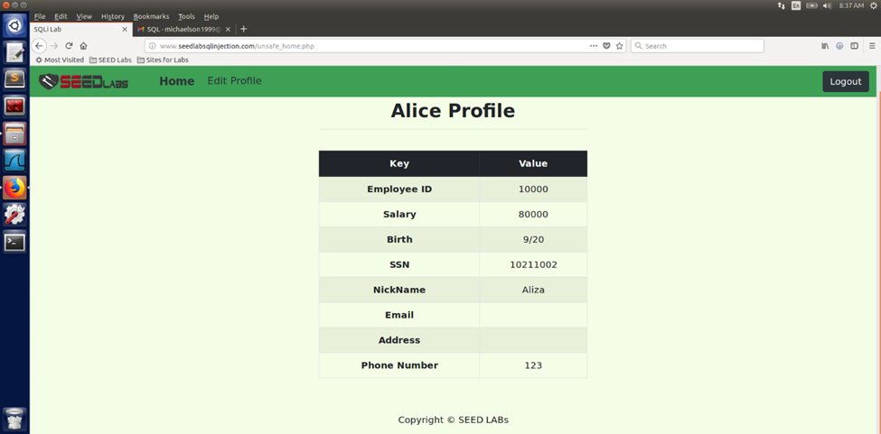
**Fig 9. Task 3.1: Modify your own salary**

After saving the profile it shows that Alice’s salary has increased from 20000 to 80000.

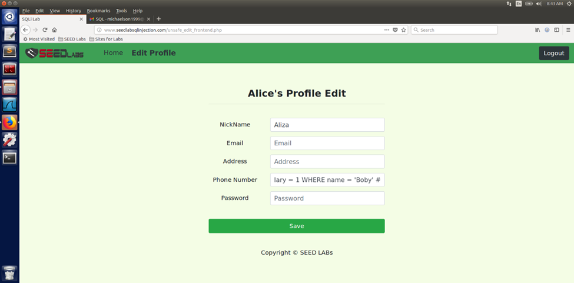
**Fig 10. Task 3.2: Modify other people's salary**

After changing her own salary, Alice wants to change her boss’s salary to be only 1 dollar, so to do this we have to put this into the Phone Number Field:

**123', salary = 1 WHERE name = 'Boby' #**

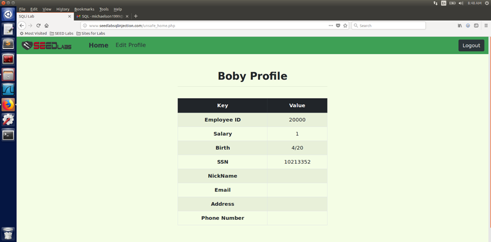
**Fig 11. Task 3.2: Modify other people's salary**

The result after saving is that Boby’s salary has successfully been decreased to 1 dollar.

**Fig 12. Task 3.3: Modify other people’s password**

In order to modify Boby’s password we have to log back into Alice’s account and use the profile edit page. Like the last two tasks, this one also takes place in the Phone Number field and we insert: **', Password = sha1(GetRekt) WHERE name= 'Boby' #**

After this we can try logging into Boby’s account with their original password, but it now does not work.

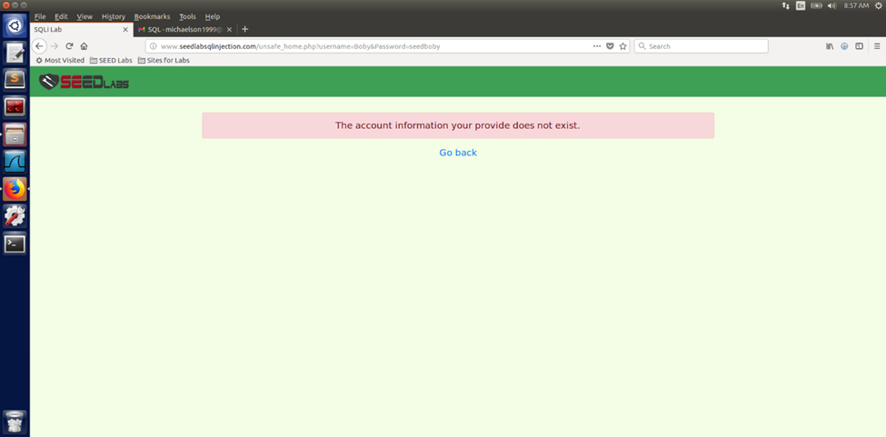
**Fig 13. Task 3.3: Modify other people’s password**

After this, we can use the new password “GetRekt” to successfully log into Boby’s account showing that the password has been changed.

## Task 4: Countermeasure — Prepared Statement

To start our countermeasure, we need to first fix the “unsafe_home.php” file. To do this, we can use terminal to navigate to “/var/www/SQLInjection” and then open “unsafe_home.php” and “safe_home.php” in a text editor.

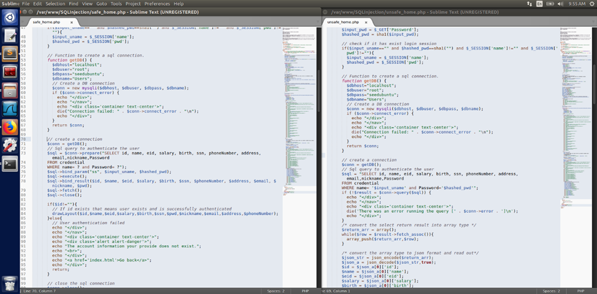
**Fig 14. Task 4: Countermeasure — Prepared Statement**

At line 70 in both files they start the connection, but the “safe_home.php” connection uses prepared statements which prevent SQL injection attacks. To fix the “unsafe_home.php” copy from lines 70 to 80 from the “safe_home.php” and use the code to replace lines 70-102 in “unsafe_home.php”. We do not need lines 83-102 in “unsafe_home.php” anymore. After this, save the altered “unsafe_home.php” and when the prompt comes up for a password it is “dees”.

Now we must reset apache2 for the changes to take effect. To do this, open terminal in the root folder and then type “sudo service apache2 reset”. If needed, the password for sudo is again “dees”.

To test if the prepared statements worked, we can do the SQL Injection from task 2.1 “Admin’ #”. After doing this we see that it did not work proving the prepared statements added work.

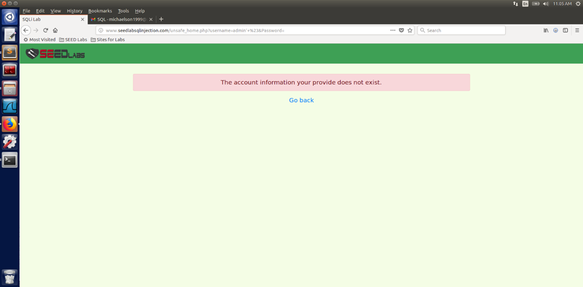
**Fig 15. Task 4: Countermeasure — Prepared Statement**

[Back to Portfolio](./)

