[Back to Portfolio](./)

Meltdown Attack Project
===============

-   **Class: CSCI 452** 
-   **Grade: N/A**
-   **Language(s): C**
-   **Project Instructions:** [Project Instructions](https://github.com/Mick7028/Mick7028.github.io/blob/master/pdf/Project5%20Meltdown%20Attack%20Instructions.pdf)
-   **Source Code Repository:** [Mick7028 / Mick7028.github.io / pdf / Project 5 Lab Report.pdf](https://github.com/Mick7028/Mick7028.github.io/blob/master/pdf/Project%205%20Lab%20Report.pdf)  
    (Please [email me](mailto:example@csustudent.net?subject=GitHub%20Access) to request access.)

## Project description

In this Meltdown Attack project, we explore cache-based side-channel vulnerabilities, focusing on a Meltdown. This project starts by understanding cache versus memory access, setting a threshold for cache hits, and demonstrating the use of cache as a side channel. Tasks include placing secret data in kernel space, attempting kernel memory access from user space, and implementing error handling. The Meltdown attack was then examined, initially with a naive approach, but later with refined methods to optimize cache behavior using assembly code. The project concluded with efforts to make the Meltdown attack more practical, including the identification and extraction of multiple bytes of secret data from kernel memory.

## How to compile / run the program

How to compile (if applicable) and run the project: N/A

## UI Design

The user interface of this project is in command line.

## Task 1: Reading from Cache versus from Memory

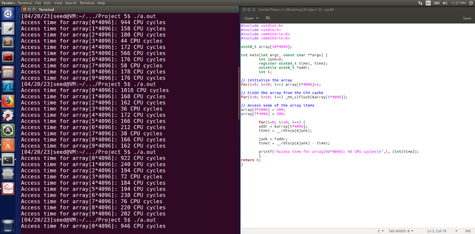
Fig 1. Task 1: Reading from Cache versus from Memory

After performing 10 runs of the program, the access of arrays [3*4096] and [7*4096] are faster than the other elements. The array that consistently took the longest to run was array[0*4096] which ran over 900 CPU cycles each time, but on the 9th run array[8*4096] ran 1056 CPU cycles but on all the other times the program ran it performed around 200 CPU cycles which proves it is necessary to run the program multiple times.

The threshold value can be found by calculating the average of each access time for each array:

Array 0: (944 + 1010 + 922 + 946 + 972 + 982 + 978 + 950 + 962 + 898) / 10 = 958.2 CPU cycles

Array 1: (158 + 168 + 240 + 188 + 204 + 158 + 164 + 198 + 206 + 304) / 10 = 198.0 CPU cycles

Array 2: (180 + 162 + 194 + 318 + 194 + 212 + 174 + 204 + 200 + 198) / 10 = 204.6 CPU cycles

**Array 3: (44 + 36 + 72 + 82 + 52 + 36 + 42 + 84 + 56 + 78) / 10 = 53.0 CPU cycles**

Array 4: (172 + 172 + 184 + 196 + 202 + 184 + 178 + 206 + 214 + 198) / 10 = 190.8 CPU cycles

Array 5: (566 + 166 + 194 + 206 + 154 + 168 + 176 + 208 + 174 + 334) / 10 = 218.2 CPU cycles

Array 6: (176 + 212 + 238 + 228 + 230 + 190 + 180 + 224 + 238 + 222) / 10 = 212.6 CPU cycles

**Array 7: (58 + 38 + 76 + 82 + 56 + 38 + 38 + 78 + 52 + 78) / 10 = 57.6 CPU cycles**

Array 8: (178 + 166 + 220 + 186 + 196 + 194 + 194 + 176 + 1056 + 194) / 10 = 230.0 CPU cycles

Array 9: (176 + 162 + 202 + 192 + 172 + 154 + 154 + 192 + 170 + 192) / 10 = 177.4 CPU cycles

After getting the average of each Array, we can set a threshold of 110 CPU cycles, because the average of Arrays 3 and 7 are around 55 CPU cycles and it would be very unlikely for them to be double of the average.

To further elaborate, the threshold value is important in the context of cache-based side-channel attacks, where an attacker can use the timing differences in accessing cached data to infer information about sensitive data being accessed by a victim process. By setting a threshold value, we can distinguish between cache hits (accessing cached data) and cache misses (accessing memory directly), which can reveal important information about the data being accessed.

In this case, setting the threshold value to 110 CPU cycles ensures that the program will only register cache hits for the sensitive data in Arrays 3 and 7, while avoiding false positives from accessing memory directly. This threshold value is critical for the success of the Flush+Reload attack in later tasks, as it allows the attacker to accurately identify when the victim process is accessing the sensitive data.

## Task 2: Using Cache as a Side Channel

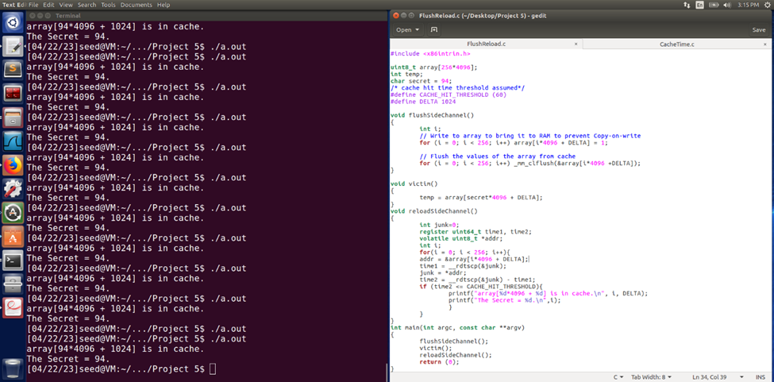
**Fig 2. Task 2.1: SQL Injection Attack from webpage.**

The image above shows the results of running FlushReload.c multiple times with the CACHE_HIT_THRESHOLD (CHT) set to "60" and "110." The CHT determines the minimum number of CPU cycles that must elapse between loading the cache line and accessing it again. When the CHT is set to "60," the program may not always return a result due to the variability of CPU cycles. However, the program still succeeds in getting the secret number correct in 15 out of 20 runs. This is because the CHT is close to the average of the cache access times of arrays 3 and 7.

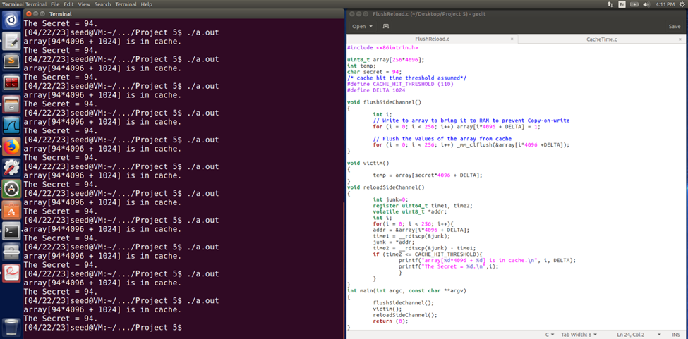
**Fig 3. Task 2.1: SQL Injection Attack from webpage.**

On the other hand, when the CHT is set to "110," FlushReload.c is able to retrieve the secret number with a 100% success rate. This is because the CPU cycles never meet the threshold, which prevents the program from accessing the wrong cache line.

These results demonstrate how the cache can be used as a side channel to leak sensitive information. By carefully selecting the CHT, an attacker can effectively perform a Flush+Reload attack to retrieve the secret data.

## Task 3: Place Secret Data in Kernel Space

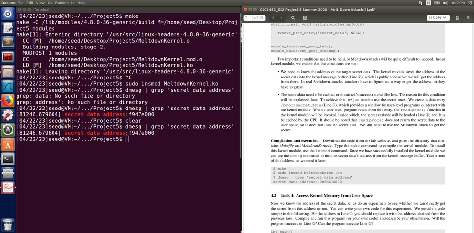
**Fig 4. Task 2.2: SQL Injection Attack from command line.**

Task 3 involves placing the secret data in the kernel space, which is an essential step in preparing for the Meltdown attack. The kernel module is created to accomplish this task, and in the process, the secret data address is discovered to be f947e000. This address is significant as it needs to be cached in order to execute the Meltdown attack successfully.

In order to perform the Meltdown attack, there are two key conditions that need to be met. The first condition is that the target memory address needs to be in the cache, and the second condition is that the program needs to be able to time the access to that memory address accurately.

Thus, finding the secret data address in the kernel space ensures that the first condition for the Meltdown attack is met. With this information, the Meltdown attack can be executed more effectively, potentially extracting sensitive information from the kernel memory.

## Task 4: Access Kernel Memory from User Space

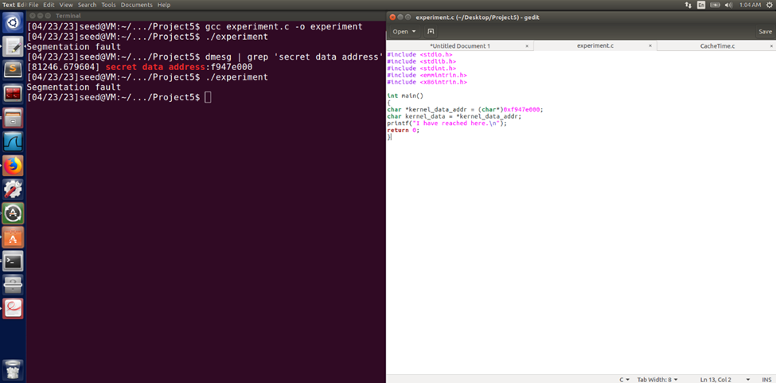
**Fig 5. Task 2.2: SQL Injection Attack from command line.**

In Task 4, an attempt was made to run the experiment.c program to access the kernel memory where the secret is located. However, the program resulted in a segmentation fault on line 2, indicating that the program failed to execute line 2. This is because the address 0xf947e000 is a kernel memory address, which user-level programs do not have direct permission to access. Therefore, the program was unable to access the kernel memory from user space, and a segmentation fault occurred.

## Task 5: Handle Error/Exceptions in C

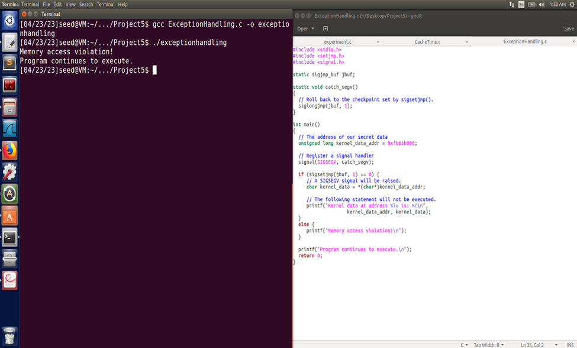
**Fig 6. Task 2.3: Append a new SQL statement.**

In Task 5, the code has been modified to handle memory access violations caused by accessing kernel memory from user space. Specifically, exception and signal handling in C are utilized to prevent program crashes when such violations occur. This is achieved by setting up a signal handler and checkpoint using sigsetjmp(). When a SIGSEGV signal is received, the program is able to roll back to the checkpoint and continue execution, thereby preventing the crash. Overall, this modification enhances the robustness and stability of the program in the face of potential memory access violations.

## Task 6: Out-of-Order Execution by CPU

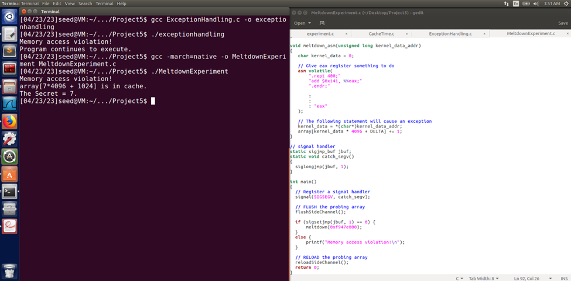
**Fig 7. Task 6: Out-of-Order Execution by CPU**

When the MeltdownExperiment.c program is run, it can successfully retrieve the secret number, which is 7. However, this success is not guaranteed, as it depends on the timing behavior of the CPU cache. Specifically, the program exploits the fact that accessing kernel memory causes the cache to behave differently, and this behavior can be measured by timing memory accesses from user space. The screenshot above shows the timing differences between running a timer program before and after executing the MeltdownExperiment.c program, for several iterations.

**Fig 8. Task 3.1: Modify your own salary**

By analyzing these timing differences, we can determine the CPU cycle times during which the MeltdownExperiment.c program is able to fully execute. According to the data in the screenshot, this time window is between 1.0967254638671875e-05 and 1.1920928955078125e-05 seconds, or 1.1-1.2 microseconds. Therefore, for the Meltdown attack to be successful, it must be executed within this time frame, which requires precise timing control and may not always be possible.

Here is the code for the timer program below that proves line 2 is executing:

#!/usr/bin/python

import time

**#initialize probing array**
probing_array = [0] * 100

**#measure time to access each element in the probing array**
start_time = time.time()
for i in range(100):
    x = probing_array[i]
end_time = time.time()

print("Time taken to access each element: ", end_time - start_time)

# The Basic Meltdown Attack

## Task 7.1: A Naive Approach

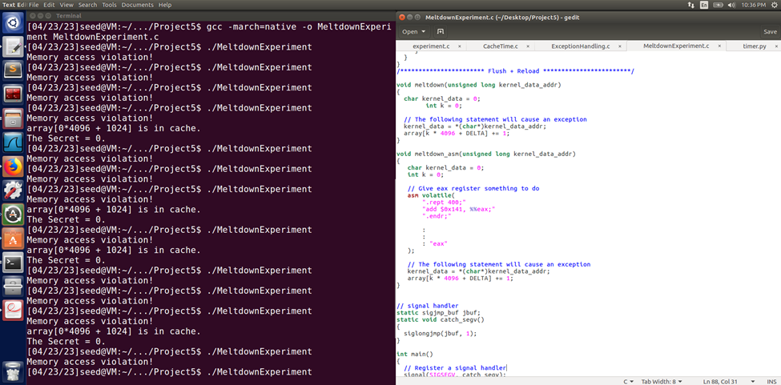
**Fig 9. Task 7.1: A Naive Approach**

The modifications to MeltdownExperiment.c are that in the functions **“void meltdown(unsigned long kernel_data_addr)”** and **“void meltdown_asm(unsigned long kernel_data_addr)”** include adding the variable **“int k = 0;”** to both functions and to change **“array[kernel_data * 4096 + DELTA] += 1;”** to **“array[k * 4096 + DELTA] += 1;”**

After completing this, running MeltdownExperiment.c will result in either printing “Memory access violation!” or:

Memory access violation!

array[0*4096 + 1024] is in cache.

The Secret = 0.

Since the secret number is always 0, we know that this attack was not successful, and more improvements need to be made.

## Task 7.2: Improve the Attack by Getting the Secret Data Cached

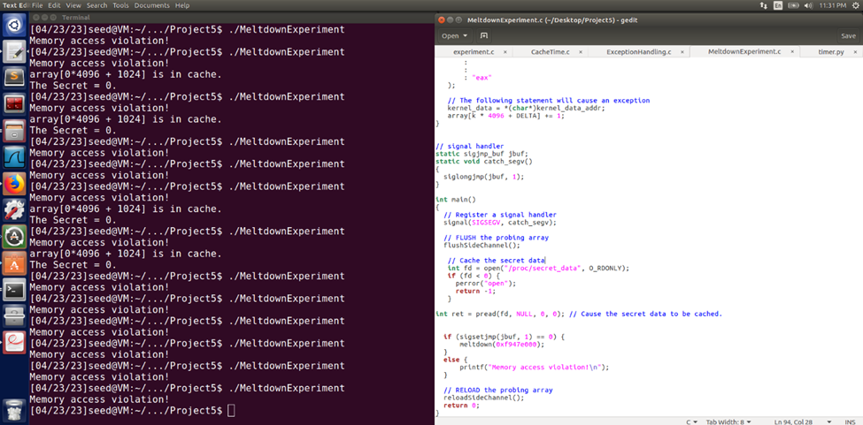
**Fig 10. Task 7.2: Improve the Attack by Getting the Secret Data Cached**

To improve the Meltdown attack, we need to add the code mentioned in this task to the MeltdownExperiment.c file in the int main() function after the flushSideChannel line. However, upon recompiling and running the program several times, it becomes clear that the success rate has not improved. The program still shows that the secret value is 0, indicating that the kernel secret data has not been cached. It is possible that the kernel data is being evicted from the cache before the reloadSideChannel() function is called, or that the cache size is too small to hold the data.

## Task 7.3: Using Assembly Code to Trigger Meltdown

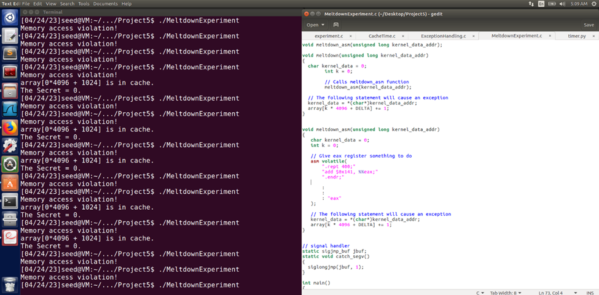
**Fig 11. Task 7.3: Using Assembly Code to Trigger Meltdown**

In Task 7.3, the code "meltdown_asm(kernel_data_addr)" was added to the meltdown function, and the function was declared right above it. The added assembly code before the kernel memory access causes extra CPU work, slowing down program execution. As more loops are added, the program takes longer to compile and execute. However, adding more loops increases the chances of success in retrieving the secret message and performing the Meltdown attack.

## Task 8: Make the Attack More Practical

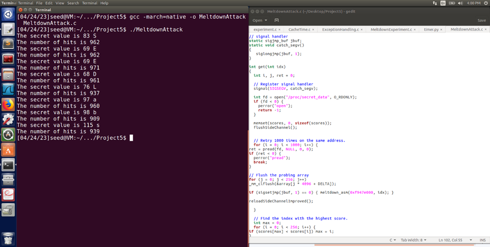
**Fig 12. Task 8: Make the Attack More Practical**

After changing the kernel memory address from “0xfb61b000” to “0xf947e000” we can compile and run the program to get a secret value of “83 S” and the number of hits is 986. This is only one byte of the eight total bytes that contain the full secret. To get the full secret value we must modify the code in the meltdown_asm function which includes instructions for reading the memory values from the victim process. In the original code, the function reads 8 bytes of memory starting from the target address and stores it in a buffer. However, since we know that the secret value is spread across multiple memory addresses, we need to modify the function to read the correct addresses.

To do this, we first need to identify the memory addresses where the secret is stored. One way to do this is by performing a brute force attack by iterating over all possible memory addresses and checking if the access causes a page fault exception. We can then use the addresses where the exception occurs as the locations of the secret bytes.

Once we have identified the correct memory addresses, we can modify the meltdown_asm function to read the secret bytes from those addresses. We can do this by changing the starting address and the length of the memory read operation in the function. Finally, we need to modify the main function to concatenate all the secret bytes and print the full secret value.

With these modifications, we should be able to successfully extract the full secret value using the Meltdown attack.

Altered code (lines 82-88):

	void meltdown_asm(unsigned long kernel_data_addr, int idx)
{
   char kernel_data = 0;
   // Give eax register something to do
   asm volatile(
       ".rept 400;"                
       "add $0x141, %%eax;"
       ".endr;" 
       :
       :
       : "eax"
   ); 
   
   // The following statement will cause an exception
   kernel_data = *(char*)kernel_data_addr;  
   array[idx*4096 + DELTA] += 1;              
}

For more details see [GitHub Flavored Markdown](https://guides.github.com/features/mastering-markdown/).

[Back to Portfolio](./)
